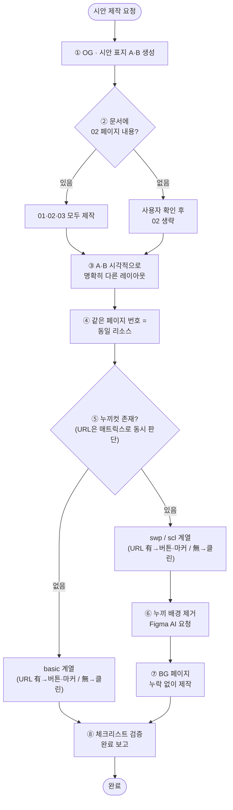

# 시안 제작 프로세스

**작성일**: 2026-05-28

> 이 문서는 시안 **작업 프로세스**(구성·파일명·체크리스트)를 정의합니다.
> 페이지 유형별 **디자인 가이드**(레이아웃·치수·컬러 등)는 [[2-2. 표지]] · [[2-3. 브랜드·컬렉션 소개]] · [[2-4. 화보·상품]]을 참고하세요.

---

## 개요

**시안이란**: 동일한 콘텐츠·구성요소로 **서로 다른 디자인(레이아웃) 2가지 안(A·B)**을 제시하여 클라이언트가 방향성을 선택하도록 하는 작업물

- **A안·B안의 구성요소·내용은 완전히 동일** — 다른 점은 채택한 **디자인(레이아웃·스타일)**뿐
- 디자인 가이드의 여러 레이아웃 옵션 중 **항상 2가지를 선택·조합**해 A안·B안을 구성
- **각 안 4페이지** → A안 4p + B안 4p = **총 8페이지**
- **목적**: 디자인 방향성 선택 & 피드백 수집
- **완성 후**: 선택된 안을 기반으로 초안(전체 페이지) 제작

### 페이지 구성 (파일명 기준)
- **시안 표지** (`A` / `B`): 로고 + 타입(TYPE-A/B) 표시
- **01**: 각 시안의 표지 (실제 콘텐츠 시작) → 디자인: [[2-2. 표지]]
- **02**: 브랜드 및 시즌 컬렉션 소개 → 디자인: [[2-3. 브랜드·컬렉션 소개]]
- **03**: 내지 (화보 및 상품 정보) → 디자인: [[2-4. 화보·상품]]

---

## 제작 단계 (Step by Step) — ⚠️ 중요

> 사용자가 시안 제작을 요청하면 **반드시 이 8단계 흐름**대로 작업합니다. 각 단계의 분기 조건은 아래 「작업 흐름 도식」을 참고하세요.
> 진행 중 각 단계마다 분기·조건을 확인하고, ⑧단계의 **체크리스트를 모두 통과해야 완료 보고**합니다.

### 1. OG 이미지 · 시안 표지(A·B)를 가장 먼저 생성
콘텐츠 본문(01~03)과 무관한 메타 영역이므로 본문 작업 전에 먼저 처리합니다.
- OG 이미지 사양: [[1-1. 공통]] 「OG 이미지(썸네일) 규칙」
- 시안 표지(A·B): 아래 「시안 표지」 섹션 — 피그마 원본 화면 + **로고만 교체**
- **로고 자산 처리**: 로고는 **배경 제거 + 여백 없이 + 원본 비율**로 사용한다.
   - 배경 있는 로고 → Figma AI(Remove background) 요청 (위치 알리고 사용자에게 직접 적용 요청)
   - **이미 투명 배경(SVG·투명 PNG)인 로고 → 요청 없이 그대로 사용** (업로드 직후 alpha 채널 유무 먼저 확인)
   - 상세 원칙: [[2-1. 공통]] 「로고·누끼 이미지 처리」

### 2. `[문서]` 폴더(엑셀·PPT)에서 페이지 순서를 확인하고 01~03 시안을 제작
- 두 시안의 페이지 흐름·콘텐츠는 **문서 파일을 기준**으로 한다.
- **02 페이지 내용이 없는 경우**(표지 다음 바로 상품 정보가 나오는 경우): **사용자에게 확인 후 02 페이지를 생략**한다.

### 3. A·B 시안은 시각적으로 명확히 다른 레이아웃 채택
"같은 유형 내 약간의 변화"가 아니라, **한눈에 봐도 다른** 레이아웃 타입·로고 위치·정렬을 선택합니다.
- 상세 기준: 아래 「레이아웃 유형 채택 기준 (중요)」

### 4. 동일 페이지 번호 = 동일 리소스 사용
A01·B01은 같은 화보, A02·B02는 같은 화보, A03·B03은 같은 누끼·상품을 사용합니다. **다른 점은 레이아웃·디자인뿐**입니다.

### 5. 03 페이지 유형 결정 — 누끼컷 × URL 매트릭스 (한 번에 판단)

> 누끼컷 유무와 URL 유무는 **직교(orthogonal)하는 두 축**이므로 **한 번의 판단**으로 03 페이지 유형이 결정됩니다.
> 이후 ⑥·⑦단계는 이 결과(swp/scl 채택 여부)를 그대로 사용하며, **누끼 유무를 재확인하지 않습니다.**

**축 1 — 누끼컷 확인**: `[리소스]` 폴더에 상품 누끼가 있는지 → 없으면 **문서 파일 내 누끼 관련 내용**(이미지·언급)을 추가 확인.
**축 2 — URL 확인**: 문서 파일 내에 상품 URL이 있는지 → 없으면 **사용자에게 한 번 더 확인**.

| 누끼컷 | URL | 03 페이지 유형 | 이후 단계 |
|--------|-----|----------------|-----------|
| ❌ 없음 | ❌ 없음 | **basic 기본형** (클린) | → 바로 ⑧ |
| ❌ 없음 | ✓ 있음 | **basic + 버튼·마커** (예: `03-basic-link`) | → 바로 ⑧ |
| ✓ 있음 | ❌ 없음 | **swp / scl** (클린) | → ⑥·⑦·⑧ |
| ✓ 있음 | ✓ 있음 | **swp / scl + 버튼·마커** | → ⑥·⑦·⑧ |

- **「버튼」의 범주**: 플러스 「+」 버튼, chevron 「›」 버튼, gif 버튼 등 **링크 진입을 표시하는 모든 버튼 유형**(특정 한 종류가 아님). 유형별 사양·매핑은 [[1-4. CdBd 콘텐츠]] 참고.
- **마커(line)**: 상품 영역 위에 표시되는 가는 선 형태(예: `03-basic-link`의 선).
- 03 유형 상세: [[2-4. 화보·상품]]

### 6. 누끼 배경 제거 — Figma AI 요청 *(⑤에서 swp/scl 채택한 경우 — ⚠️ 블록(blocking) 단계)*

> ⚠️ **이 단계는 swp/scl 페이지 본문 빌드의 사전(blocking) 작업입니다.**
> **가공 전 원본 누끼로 product 셀을 먼저 만들면 안 됩니다.** 원본을 셀에 박은 채로 사용자가 일괄 가공하려 하면 ① 셀 안 이미지 hash가 자동 교체되지 않아 누락이 생기거나, ② 사용자가 셀마다 따로 처리해야 해 비효율적입니다.
> **반드시 누끼 가공 완료 신호를 받은 뒤** swp/scl product 셀을 빌드합니다.

**절차** (순서대로):

1. **별도 위치에 누끼 업로드**: 03 페이지 본문 영역이 아닌 **작업 section 인접한 빈 공간**(또는 별도 임시 그리드)에 03 페이지 전부에 사용할 **누끼컷을 모두 업로드**한다. **이 시점에는 swp/scl product 셀을 아직 빌드하지 않는다.**
2. **alpha 채널 선확인**: 업로드 직후 각 누끼의 alpha 채널 유무를 확인한다.
   - **이미 배경이 없는 누끼**(SVG · 투명 PNG 등)는 가공 요청 없이 그대로 사용 가능 → 다음 단계로.
   - **배경이 있는 누끼**(JPG 등 alpha 없음)만 3단계로 진행.
3. **사용자에게 Figma AI Remove background 요청**: 업로드된 **위치(노드 ID·페이지명)를 사용자에게 알리고 일괄 가공을 요청**한다.
   - ⚠️ Figma AI는 **에디터 전용** — 자동화 API(`use_figma`)로 호출 불가. `CLAUDE.md` 「레이아웃 핵심 원칙」 참고.
4. **사용자의 「가공 완료」 신호 대기**: **신호 받기 전까지 swp/scl 페이지 product 셀 빌드를 시작하지 않는다.** 단, **다른 페이지**(01·02·시안 표지·OG·03-BG 등 누끼와 무관한 페이지)는 **병렬 진행 가능**.
5. **가공 완료 후**: 처리된 누끼 이미지(투명 배경)를 사용해 swp/scl product 셀을 빌드한다.

- 공통 원칙: [[2-1. 공통]] 「로고·누끼 이미지 처리」 (배경 제거 + 여백 없이 + 원본 비율)

### 7. BG 페이지 누락 방지 *(⑤에서 swp/scl 채택한 경우)*
- swp/scl이 **BG 페이지를 포함하는 유형**(swp-full / swp-blur / scl-full / scl-blur 등)인지 확인한다.
- 포함 시 `03-BG` 페이지를 **반드시 누락 없이 함께 제작**한다 (BG → swp1 → swp2 … 순).
- 유형별 BG 구성: [[2-4. 화보·상품]]

### 8. 완료 보고 전 체크리스트 검증
아래 「작업 체크리스트」 — 특히 **「최종 검증 (완료 보고 전)」 카테고리**를 통과해야 사용자에게 완료 보고합니다. 미충족 항목이 있으면 보고 전에 먼저 수정합니다.

### 작업 흐름 도식

> **분기 요약**
> · **02 페이지 내용 없음** → 사용자 확인 후 생략 (그 외 단계는 동일하게 진행)
> · **누끼컷 없음** → 03 = basic 계열 → ⑥·⑦단계 건너뛰고 바로 ⑧
> · **누끼컷 있음** → 03 = swp/scl 계열 → ⑥(배경 제거) · ⑦(BG 페이지) · ⑧ 진행
> · **URL** → 누끼 유무와 직교. ⑤ 매트릭스에서 동시 판단되어 **버튼·마커 포함 여부**만 결정 (다운스트림 ⑥·⑦에 영향 없음)

---

## 레이아웃 유형 채택 기준 (중요)

시안에서 A·B 2안의 레이아웃을 채택할 때 **가장 중요한 기준**입니다.

### 01·02 페이지 — 안 내 통일 + A·B 차이 명확
- **비슷한 타입의 유형을 선택하되**(한 안 안에서 01·02는 통일), **A안과 B안의 차이는 명확해야** 합니다.
- 예) **A** = 프레임 타입 · 로고 **상하 중앙 정렬** ↔ **B** = 풀블리드(clean) 타입 · 로고 **상단/하단 배치** — **화보 처리 방식·로고 위치**가 뚜렷이 달라야 합니다.

### 03 페이지 — 리소스(분량)에 따라 타입 결정
- 전달받은 **리소스의 종류·분량**에 따라 03 내지 타입을 선택합니다.
  - **화보 이미지 + 상품 정보 텍스트**만 받은 경우 → **basic**
  - **누끼(상품) 이미지**까지 받은 경우 → **swp(스와이프) / scl(스크롤)**
- 각 타입의 상세 규칙은 [[2-4. 화보·상품]] 참고.

---

## 공통 규격 및 내보내기

**기본 페이지 규격, 해상도, 파일 형식, 파일명 규칙 등은 [[1-1. 공통]]을 참고하세요.**

---

## 시안 표지 (`A` / `B`)

A안·B안을 구분하는 맨 앞 표지. **피그마 제공 화면을 그대로 사용하고 로고만 교체**합니다.

| 안 | 노드 ID | 타입 텍스트 |
|----|---------|-------------|
| A | 16001:96 | TYPE - A |
| B | 16001:106 | TYPE - B |

**제작 방법**:
- 피그마 화면의 로고 영역만 브랜드 로고로 교체
- 배경, 타입 텍스트, 배치 등 나머지는 원본 그대로 유지
- **로고 크기 (면적 기준)** — 시안 표지 프레임 면적(380 × 580 = **220,400 px²**) 대비:
  - 로고는 **「배경·여백이 제거된 bounding box」 면적이 표지 프레임 면적의 약 2.5%** (≈ 5,500 px²)가 되도록 한다.
  - **면적 기준이므로 로고 가로세로 비율에 관계없이 시각 비중이 일정**하게 유지된다 ([[2-1. 공통]] OG 로고 크기 규칙과 동일 원리).
  - **참조**: `PRENDANG` (시안 표지 A) — 214 × 26 = 5,564 px² → **2.52%** · 노드 `14015:23` (logo-bk `14015:42`)
- 로고는 비율을 유지하며 배치 (왜곡 금지)

---

## 페이지별 구성 요소

> A안·B안은 아래 구성요소를 **동일하게** 포함하며, 레이아웃 변형(타입·로고 위치·정렬 등) 중 **2가지를 선택**해 서로 다른 디자인으로 제작합니다.
> 각 요소의 디자인 규칙(레이아웃·치수·컬러)은 디자인 가이드 문서를 참고합니다.

### 시안 표지 (`A` / `B`)
- **필수**: 브랜드 로고 (피그마 원본 위치에 교체)
- **유지**: 배경 처리(피그마 원본 유지), "TYPE - A" / "TYPE - B" 텍스트(위치·크기 동일)

### 01 — 각 시안의 표지
- **필수**: 배경 화보, 로고
- **선택**: 시즌명, 시즌 타이틀

### 02 — 브랜드·컬렉션 소개
- **필수**: 배경 화보 + `#000000` dim 오버레이, 로고, 컬렉션 설명 텍스트
- **선택**: 시즌명, 시즌 타이틀

### 03 — 화보·상품
- **필수**: 상품 화보 이미지, 상품명, 가격
- **선택**: 카테고리(SUIT, SHIRT, PANTS 등), 색상/사이즈 옵션, 상세 설명 텍스트

---

## 스와이프(swp) 페이지 분할 (과금 주의)

- **스와이프 페이지 수는 과금 기준에 포함된다.**
- 03 swp(스와이프)를 만들 때는, 확인한 리소스(상품 이미지)로 **제품 개수를 먼저 파악**한 뒤, **사용자에게 "몇 페이지로 나눌지" 반드시 확인**하고 진행한다.

---

## 작업 체크리스트

### 안 구성 확인
- [ ] A안·B안의 구성요소·내용이 동일한가 (동일 페이지 번호 = 동일 리소스)
- [ ] A안·B안이 서로 다른 레이아웃/디자인 2가지를 채택했는가 (한눈에 봐도 다른 레이아웃)
- [ ] 01·02 페이지의 표지 레이아웃 타입(thin frame / clean / thick frame)이 (안 내에서) 통일되었는가
- [ ] 01·02의 **A·B 레이아웃 차이가 명확**한가 (타입·로고 위치)
- [ ] 03은 **전달 리소스에 맞는 타입**인가 (텍스트만→basic / 누끼→swp·scl)
- [ ] swp/scl 사용 시 **BG 페이지가 누락 없이 포함**되었는가 (해당 유형인 경우)
- [ ] 상품 링크(URL) 유무에 따라 **버튼·마커(line) 포함 여부**가 일치하는가
- [ ] 02 페이지 내용이 없는 경우 **사용자 확인 후 생략**되었는가

### 시안 표지 확인
- [ ] 피그마 기준 화면 사용, 로고만 교체
- [ ] 배경/타입 텍스트/배치는 원본과 동일

### 페이지별 확인
- [ ] 각 페이지 필수 요소 포함
- [ ] 이미지 비율 및 해상도 확인
- [ ] 텍스트 오타 검수 / 가독성 확인
- [ ] 디자인 규칙(레이아웃·치수·컬러) 준수 여부 — 디자인 가이드 대조

### 최종 검증 (완료 보고 전) — ⚠️ 사용자 보고 전 반드시 통과

**자산·기본**
- [ ] **OG 이미지 생성 여부**: 800×400 로고 타입(혹은 요청 시 룩 타입)이 별도로 생성되었는가 (시안 표지와 별개 — Step ①의 OG 누락 금지)
- [ ] **페이지별 로고 면적 기준 (각 페이지 측정 → 표 대조)** — 로고 bbox 면적 = `node.width × node.height` (배경·여백 제거 상태). 페이지 면적은 380×580 = **220,400 px²** (OG만 800×400 = **320,000 px²**). 각 페이지 유형별 기준 비율 ±10% 허용:

  | 페이지 유형 | 위치 | 면적 비율 | 참고 (px²) | 참조 |
  |------------|------|-----------|-----------|------|
  | **OG** | 중앙 | 9~10% | 28,800~32,000 | [[2-1. 공통]] |
  | **시안 표지** | (브랜드별 위치) | ~2.5% | ~5,500 | 본 문서 「시안 표지」 |
  | **01-A·B** (분리형) | 페이지 내 | 2.5~2.6% | 5,500~5,700 | [[2-2. 표지]] |
  | **01-C·D** (묶음형, 로고+시즌명) | 페이지 내 | 1.8~2.2% | 3,900~4,900 | [[2-2. 표지]] |
  | **02** (브랜드·컬렉션) | 페이지 내 | ~1.2% | ~2,600 | [[2-3. 브랜드·컬렉션 소개]] |
  | **03 basic-frame / basic-footer** | — | ~1.2% | ~2,600 | [[2-4. 화보·상품]] |
  | **03 swp clean BG** (BG 페이지 상단 좌측, 항상 노출) | top-left 마커 | ~0.5% | ~1,100 | [[2-4. 화보·상품]] |
  | **03 swp full** (페이지 상단 중앙, swp2~ 노출) | top-center 마커 | ~0.5% | ~1,100 | [[2-4. 화보·상품]] |
  | **03 swp blur BG** (swp1 cover 하단 중앙, **swp1에만**) | bottom-center | ~2.3% | ~5,100 | [[2-4. 화보·상품]] |
  | **03 swp blur swp2~** | — | 로고 없음 | 0 | (있으면 잘못 추가됨) |
  | **03 scl frame-grid2/3** | 페이지 내 | 약 1.0~1.3% | 2,200~2,900 | [[2-4. 화보·상품]] |
  | **03 scl row / blur-grid / full-grid** | 마커 | 약 0.5% | ~1,100 | [[2-4. 화보·상품]] |
  | **매장 정보** | — | — | — | [[2-5. 매장 정보]] |

  검증 절차: ① 각 페이지의 로고 RECTANGLE 노드 측정 (`get_metadata` 또는 `use_figma`로 w·h 추출) → ② w·h 곱해 면적 산출 → ③ 페이지 면적으로 나눠 비율 산출 → ④ 위 표 기준 ±10% 안에 들어가는지 확인. **clean·blur·full 유형 판별 후 해당 행과 대조**. **누락(있어야 하는데 없음) / 잘못 추가(없어야 하는데 있음) 도 함께 확인**.
- [ ] **로고 배경·여백**: 배경이 제거된 상태이고, 여백 없이 **원본 비율**로 사용되었는가 *(이미 투명 배경인 SVG·투명 PNG는 자동 통과)*
- [ ] ⚠️ **로고 alpha bbox 크롭 (상하·좌우 투명 여백 0)**: 클라이언트 제공 로고 PNG에 alpha=0 여백이 박혀 있지 않은가 — 임시 RECT(소스 원본 사이즈)에 magenta `#FF00FF` backing rect를 깐 뒤 `screenshot({scale:12})`로 캡처해서 magenta 노출 영역 확인. 여백이 있으면 ① 소스 PNG를 PIL `getbbox()+crop()`으로 잘라 재업로드 (옵션 A) **또는** ② `scaleMode:"CROP"` + `imageTransform`으로 가시 bbox만 샘플링 + rect를 가시 콘텐츠 비율에 맞춰 면적 보존 리사이즈 (옵션 B, 같은 hash 공유 시 권장). 상세: [[2-1. 공통]] 「로고·누끼 이미지 처리」 「⚠️ 로고도 alpha bbox 크롭 필수」.
- [ ] 각 페이지의 **로고·텍스트 색상이 배경 이미지의 명도와 충분한 대비**를 가지는가

**화보·페이지 유형 정합**
- [ ] **화보 이미지 구조**: 프레임 자체의 fill이 아닌 **별도 자식 RECTANGLE 레이어로 가장 아래(z-index 0)** 배치되어 있는가. 부모 프레임 `clipsContent = true`이고, 자식 rect의 사이즈·위치를 자유롭게 조정 가능한 구조인가 (CLAUDE.md 「화보 비크롭」 원칙 정확 구현)
- [ ] 각 화보의 **모델 중요 부위(얼굴·머리)가 잘리거나 한쪽으로 치우치지 않았는가** — scaleMode(필요 시 FIT)·inner-image 프레임 크기·imageTransform 조정으로 머리 잘림 방지
- [ ] **03 화보 페이지 모델 중앙 정렬**: 모델이 화면 중앙(좌우·상하)에 위치하는가
- [ ] **풀샷 원본인 경우 머리·발 모두 표시**: 원본 화보가 풀샷이면 **머리와 발이 모두 잘리지 않고 보이도록** 화보 rect 사이즈/위치 조정. 머리 상단 여백 적절히 확보 (지나치게 넓거나 좁지 않게)
- [ ] **thin frame 외곽선 두께**: 디자인 가이드 기준값과 일치하는가 (참고: 02-thin frame `strokeWeight = 10`, [[2-3. 브랜드·컬렉션 소개]] 「레이아웃 타입」 피그마 레퍼런스 `16008:311`)
- [ ] **blur BG type 「sharp inner image」 포함**: blur BG 페이지(01-blur, 03-swp-blur 등)는 **「블러+확대 배경 + 선명한 inner 화보 이미지」 구조**를 따르는가 — sharp inner image 누락 금지 ([[2-2. 표지]] blur BG type 참고). 03-swp-blur의 경우 **BG 페이지·swp1 모두에 sharp inner image** 포함 권장.
- [ ] **swp/scl 페이지 유형 정합**: 단독 swp 페이지(swp1·swp2…)는 가이드 명세대로 **standalone 카드**(예: blur BG 타입 = 340×520 카드)인가 — **blur 배경을 swp 페이지마다 반복 적용하지 않음**(blur BG는 BG 페이지 전용으로 한 번만 적용). **clean(풀블리드) type 380×580 — drop shadow 없음**, **blur type 340×520 + drop shadow**.

**누끼 그리드**
- [ ] **누끼 그리드 정렬**: 문서 파일에서 요청한 순서대로 정렬되었는가
- [ ] **누끼 그리드 정렬**: 배경 제거 후 여백이 제거된 이미지로 모두 사용되었는가 *(이미 투명 배경이면 자동 통과)*
- [ ] ⚠️ **누끼 alpha bbox 크롭 (여백 제거)**: 모든 상품 누끼는 **alpha 채널 bounding box로 크롭**되어 투명 여백이 0이어야 한다. **배경 제거(Figma AI Remove background)만으로는 부족** — Remove background는 배경 픽셀을 alpha=0으로 만들 뿐 캔버스 크기는 그대로 두므로, 결과 PNG의 alpha bbox 바깥에 투명 여백이 남는다. 이 여백을 PIL `getbbox()` + `crop()`(혹은 동등 처리)으로 잘라야 cell 내에서 상품 면적이 균등해진다. 워크플로우: ① 가공된 누끼 hash bytes export → ② PIL `Image.open(...).getbbox()` → ③ `.crop(bbox)` → ④ 크롭된 PNG 재업로드 → ⑤ 새 hash로 fill 교체. RECT 사이즈는 크롭 후 aspect ratio 그대로 적용(동일 면적 S 유지 → w=√(S·a), h=√(S/a), a=bbox_w/bbox_h).
- [ ] **누끼 그리드 정렬**: 동일한 라인·상품이 같은 행에 배열되었는가
- [ ] **누끼 같은 라인 행 순서 = top→bottom**: 같은 세트의 상품을 한 행에 배치할 때 **좌측 = 상의(top), 우측 = 하의(bottom)** 순서로 배치 (예: Jacket 좌 + Pants 우, Cropped Jkt 좌 + Cotton Short 우)
- [ ] **swp 2행 그리드 vertical center**: swp 페이지에 2행만 배치되는 경우, 카드 내에서 **상하 균등 여백으로 수직 중앙 정렬** (위·아래 어느 한쪽 치우침 없음)

---

## 참고 자료

**피그마 프로토타입**: https://www.figma.com/design/SI36czRu3lBgkPzyrnPYkB/
- **시안 표지 A**: 노드 ID 16001:96
- **시안 표지 B**: 노드 ID 16001:106

> 페이지 유형별 레이아웃 섹션 노드 ID는 각 디자인 가이드 문서의 「피그마 레퍼런스」를 참고하세요.

**공통 규칙**: [[1-1. 공통]]
**디자인 가이드**: [[2-1. 공통]] · [[2-2. 표지]] · [[2-3. 브랜드·컬렉션 소개]] · [[2-4. 화보·상품]] · [[2-5. 매장 정보]]
